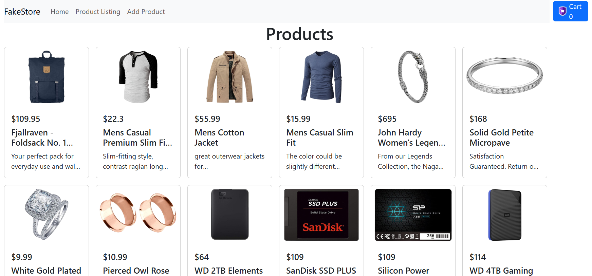

# FakeStore E-Commerce App


A React + Vite e-commerce demo app using FakeStore API. Features product listing, add/edit/delete, cart, toast notifications, and responsive design.

## Getting Started

### 1. Clone the repository
```sh
git clone https://github.com/DhanushkaChandimal/FakeStore-E-Commerce-App.git
cd FakeStore-E-Commerce-App
```

### 2. Install dependencies
```sh
npm install
```

### 3. Run the app locally
```sh
npm run dev
```
Visit the local URL shown in your terminal (usually http://localhost:5173).

### 4. Build for production
```sh
npm run build
```

### 5. Preview production build
```sh
npm run preview
```

## Features
- Product list, details, add/edit/delete
- Cart with persistent storage
- Toast notifications for actions/errors
- Responsive navbar and layout
- Loading indicator overlay

## Screenshots


## Troubleshooting
- If you see CORS errors, always run with `npm run dev` and use the local server URL.
